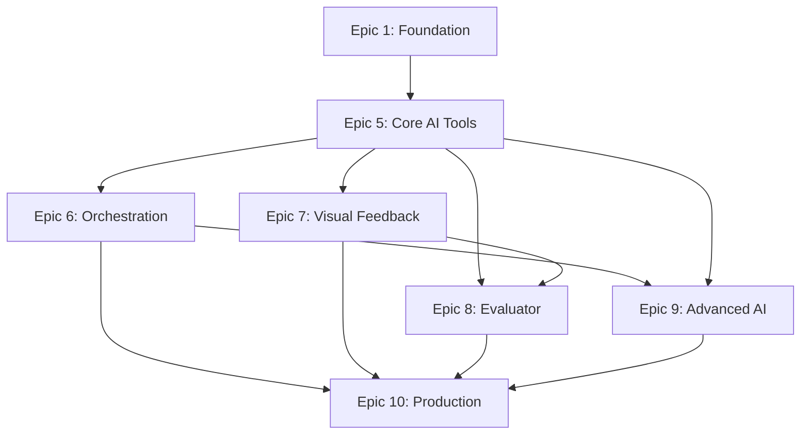

# FotoFun AI Integration - Epic Management

## Project Overview
This directory contains all epic documentation for the FotoFun AI integration project. The project is divided into 10 epics, with 4 developers working in parallel on different aspects of the system.

## Epic Summary

### Foundation & Infrastructure (Epics 1-4)
| Epic | Title | Status | Developer | Branch |
|------|-------|---------|-----------|---------|
| 1 | Foundation & Current Tools | 🚧 In Progress | Dev 1 | `epic-1-foundation-tools` |
| 2 | Core Drawing & Text Tools | 📋 Planned | Dev 2 | `epic-2-drawing-text` |
| 3 | Advanced Selection & Transform | 📋 Planned | Dev 3 | `epic-3-selection-transform` |
| 4 | Retouching & Correction Tools | 📋 Planned | Dev 4 | `epic-4-retouching` |

### AI Integration (Epics 5-10)
| Epic | Title | Status | Developer | Branch | Dependencies |
|------|-------|---------|-----------|---------|--------------|
| 5 | Core AI Tool Implementation | 📋 Planned | Dev 1 | `epic-5-core-ai-tools` | - |
| 6 | Intent Recognition & Orchestration | 📋 Planned | Dev 2 | `epic-6-orchestration-system` | Epic 5 |
| 7 | Visual Feedback & Approval | 📋 Planned | Dev 3 | `epic-7-visual-feedback` | Epic 5 |
| 8 | Evaluator-Optimizer & Quality | 📋 Planned | Dev 2 | `epic-8-evaluator-optimizer` | Epics 5, 7 |
| 9 | Advanced AI Features | 📋 Planned | Dev 1 | `epic-9-advanced-ai` | Epics 5, 6 |
| 10 | Production Readiness | 📋 Planned | Dev 3 | `epic-10-production-readiness` | All |

## Development Workflow

### 1. Starting an Epic
```bash
# Pull latest main
git checkout main
git pull origin main

# Create epic branch
git checkout -b epic-X-descriptive-name

# Install dependencies
bun install
```

### 2. During Development
- Run `bun lint && bun typecheck` frequently
- Fix errors/warnings in YOUR files only
- NO `eslint-disable` or `@ts-ignore` allowed
- Test all functionality manually
- Update epic document with progress

### 3. Creating Pull Request
```bash
# Ensure clean build
bun lint && bun typecheck

# Commit with conventional commits
git add .
git commit -m "feat: add brightness adjustment tool"

# Push and create PR
git push origin epic-X-descriptive-name
```

### 4. PR Requirements
- Title: "Epic X: [Epic Title]"
- Description must include:
  - Reference to epic document
  - List of completed items
  - Test scenarios covered
  - Screenshots/demos if applicable
- Request review from at least one developer
- All CI checks must pass

## Coordination Guidelines

### Communication
- **Primary Channel**: #dev-canvas (Slack/Discord)
- **Daily Standups**: Share progress and blockers
- **Weekly Sync**: Review epic progress and dependencies

### File Ownership
| Area | Owner | Files |
|------|-------|-------|
| AI Tools | Epic 5 | `lib/ai/tools/`, `lib/ai/confidence/` |
| Orchestration | Epic 6 | `lib/ai/orchestration/`, `lib/ai/intent/` |
| UI Components | Epic 7 | `components/editor/dialogs/`, `components/editor/VisualComparison/` |
| Evaluation | Epic 8 | `lib/ai/evaluation/`, `lib/ai/optimization/` |
| Advanced Features | Epic 9 | `lib/ai/generation/`, `lib/ai/agents/` |
| Infrastructure | Epic 10 | `lib/ai/errors/`, `lib/ai/monitoring/` |

### Shared Resources
If you need to modify shared files:
1. Post in #dev-canvas channel
2. Coordinate with affected developers
3. Create a separate PR if needed
4. Document changes clearly

## Technical Standards

### Code Quality
- TypeScript strict mode enabled
- No `any` types without justification
- All functions must have proper types
- Comprehensive error handling

### AI SDK v5 Compliance
- Use `inputSchema` not `parameters`
- Handle all tool states properly
- Implement proper streaming
- Follow SDK error patterns

### Testing Requirements
- Manual testing for all features
- Document test scenarios
- Performance benchmarks where applicable
- Edge case coverage

## Epic Dependencies



## Progress Tracking

### Completed ✅
- Project setup and infrastructure
- Basic canvas tools (Move, Select, Brush, etc.)
- AI chat interface foundation

### In Progress 🚧
- Epic 1: Foundation improvements
- Undo/Redo system
- Layer management

### Upcoming 📋
- AI tool implementation (Epic 5)
- Orchestration system (Epic 6)
- Visual feedback system (Epic 7)
- Quality optimization (Epic 8)
- Advanced features (Epic 9)
- Production readiness (Epic 10)

## Resource Links

### Documentation
- [AI SDK v5 Documentation](https://v5.ai-sdk.dev/)
- [AI SDK v5 Tools Guide](https://v5.ai-sdk.dev/docs/foundations/tools)
- [Orchestrator-Worker Pattern](https://v5.ai-sdk.dev/docs/foundations/agents#orchestrator-worker)
- [Evaluator-Optimizer Pattern](https://v5.ai-sdk.dev/docs/foundations/agents#evaluator-optimizer)

### Internal Docs
- [AI Integration Plan](.pm/ai/ai-integration-plan.md)
- [Architecture Decisions](../architecture/)
- [API Documentation](../api/)

## Risk Management

### Technical Risks
1. **AI API Rate Limits**: Mitigated by Epic 10 rate limiting
2. **Performance**: Addressed by caching and optimization
3. **Cost Management**: Tracked by billing system in Epic 10

### Coordination Risks
1. **Merge Conflicts**: Minimized by file ownership
2. **Dependencies**: Clear epic ordering and communication
3. **Scope Creep**: Strict epic boundaries

## Success Metrics

### Development Metrics
- Zero lint/type errors in production
- 100% manual test coverage
- <5s response time for AI operations
- 99.9% uptime

### User Experience Metrics
- Intuitive AI tool interactions
- <500ms preview generation
- Clear visual feedback
- Accurate intent recognition

## FAQ

### Q: What if I need to modify files from another epic?
A: Post in #dev-canvas, coordinate with the owner, and consider a joint PR.

### Q: How do I handle AI SDK v5 beta type issues?
A: Refer to Epic 5's approach to type casting and tool factory patterns.

### Q: What's the testing standard?
A: Manual testing of all features, documented test scenarios, no suppressions.

### Q: How do we handle epic dependencies?
A: Complete prerequisite epics first or coordinate for parallel development with clear interfaces.

## Getting Help

- **Technical Questions**: Post in #dev-canvas with epic number
- **AI SDK Issues**: Check Epic 5 examples first
- **Coordination**: Reach out to epic owner directly
- **Blockers**: Raise in daily standup

---

Last Updated: [Current Date]
Epic Count: 10
Active Developers: 4
Target Completion: [Project Timeline] 