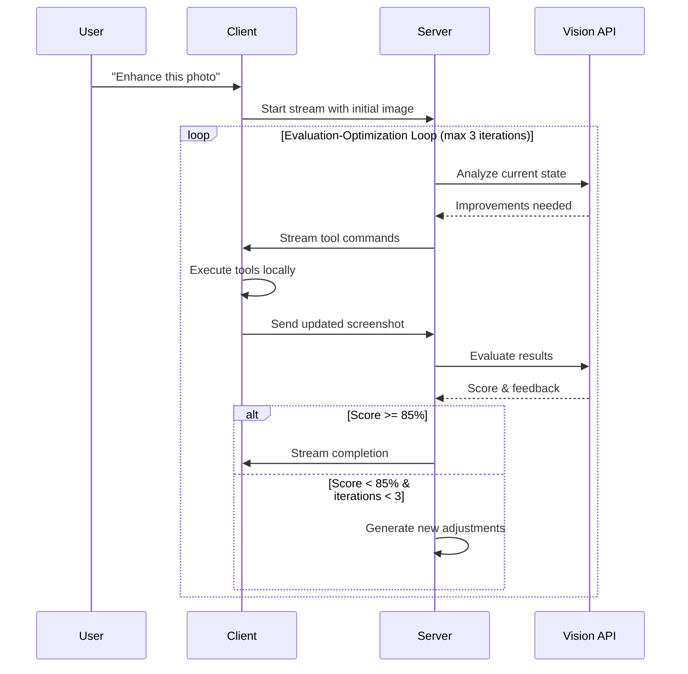

# Epic 5.35: Streaming Agent with Evaluator-Optimizer Pattern

## Overview

This epic implements a robust evaluator-optimizer pattern using AI SDK v5's streaming capabilities, enabling real-time image optimization with computer vision feedback loops. The solution maintains client-side tool execution while orchestrating the evaluation loop server-side.

## Problem Statement

The current implementation breaks after client-side tool execution because:
1. No automatic evaluation loop continuation
2. Vision model can't access updated canvas state
3. Context lost between client-server round trips
4. Manual iteration required instead of automated optimization

## Solution Architecture

### Core Concept
Use AI SDK v5's native streaming and multi-step capabilities to create a bidirectional communication channel where:
- Server orchestrates the evaluation loop
- Client executes canvas tools
- Screenshots flow back to server for vision analysis
- Context maintained throughout iterations

### Technical Approach


## Implementation Plan

### Phase 1: Core Infrastructure (Week 1)

#### 1.1 Enhanced Streaming Protocol
```typescript
// types/streaming.ts
interface StreamMessage {
  type: 'screenshot' | 'tool-result' | 'evaluation' | 'progress';
  data: any;
  metadata: {
    iterationCount: number;
    timestamp: number;
    sessionId: string;
  };
}

interface IterationState {
  originalRequest: string;
  currentIteration: number;
  adjustmentHistory: Array<{
    iteration: number;
    tools: Array<{ name: string; params: any }>;
    evaluation: { score: number; feedback: string };
    screenshot: string;
  }>;
  currentScreenshot: string;
}
```

#### 1.2 Server-Side Orchestration
- Create `/api/ai/optimize` endpoint using `streamText`
- Implement tools: `analyzeImage`, `executeClientTools`, `evaluateResults`
- Add iteration state management
- Configure `maxSteps` for multiple iterations

#### 1.3 Client-Side Stream Handler
- Implement `useOptimizationStream` hook
- Handle `CLIENT_EXECUTION_REQUEST` tool calls
- Automatic screenshot capture after tool execution
- Return results with updated canvas state

### Phase 2: Tool Execution Bridge (Week 1-2)

#### 2.1 Bidirectional Tool Communication
```typescript
// Server signals client execution
executeClientTools: tool({
  execute: async ({ tools }) => ({
    type: 'CLIENT_EXECUTION_REQUEST',
    tools,
    requestId: generateId()
  })
})

// Client executes and responds
onToolCall: async ({ toolCall }) => {
  if (args.type === 'CLIENT_EXECUTION_REQUEST') {
    const results = await executeTools(args.tools);
    const screenshot = await captureCanvas();
    return {
      type: 'CLIENT_EXECUTION_COMPLETE',
      results,
      updatedScreenshot: screenshot
    };
  }
}
```

#### 2.2 Screenshot Optimization
- Implement efficient canvas capture
- Image compression (JPEG quality 0.8)
- Resolution limiting (max 1024x1024)
- Base64 encoding optimization

#### 2.3 Tool Execution Manager
- Sequential tool execution
- Error handling per tool
- Result aggregation
- State preservation

### Phase 3: Vision Integration (Week 2)

#### 3.1 Vision Analysis Tool
```typescript
analyzeImage: tool({
  execute: async ({ screenshot, request, previousAdjustments }) => {
    const analysis = await openai('gpt-4o').generateText({
      messages: [{
        role: 'user',
        content: [
          { type: 'text', text: `Analyze for: "${request}"` },
          { type: 'image', image: screenshot }
        ]
      }]
    });
    return {
      analysis: analysis.text,
      suggestedAdjustments: parseAdjustments(analysis.text)
    };
  }
})
```

#### 3.2 Evaluation Tool
- Compare before/after screenshots
- Extract numerical score (0-1)
- Generate actionable feedback
- Determine continuation logic

#### 3.3 Adjustment Deduplication
- Track all previous adjustments
- Prevent repeated operations
- Suggest alternative approaches

### Phase 4: Progress & UI (Week 2-3)

#### 4.1 Real-time Progress Tracking
```typescript
interface Progress {
  iteration: number;
  phase: 'analyzing' | 'executing' | 'evaluating';
  tools?: string[];
  evaluation?: {
    score: number;
    feedback: string;
  };
}
```

#### 4.2 Progress UI Component
- Visual iteration counter
- Current phase indicator
- Tool execution list
- Score visualization
- Evaluation feedback display

#### 4.3 User Controls
- Cancel optimization button
- Accept intermediate results
- Manual iteration trigger
- Adjustment history view

### Phase 5: Production Readiness (Week 3)

#### 5.1 Error Handling
- Network failure recovery
- Tool execution timeouts
- Vision API fallbacks
- Graceful degradation

#### 5.2 Performance Optimization
- Request debouncing
- Parallel tool execution where possible
- Caching of vision results
- Progressive enhancement

#### 5.3 Monitoring & Analytics
- Iteration count tracking
- Success rate metrics
- Tool usage statistics
- Performance timing

## Technical Requirements

### Dependencies
- AI SDK v5 (latest)
- OpenAI SDK with vision support
- Fabric.js for canvas operations
- Image compression libraries

### API Changes
- New `/api/ai/optimize` endpoint
- Modified tool execution flow
- Enhanced streaming protocol

### State Management
- Iteration context preservation
- Screenshot history
- Tool execution logs
- Evaluation scores

## Success Criteria

1. **Automated Iteration**: System performs up to 3 iterations without user intervention
2. **Vision Accuracy**: Evaluation scores align with user perception
3. **Performance**: Each iteration completes within 10 seconds
4. **Reliability**: 95% success rate for optimization requests
5. **User Satisfaction**: Clear progress indication and control

## Risk Mitigation

### Technical Risks
1. **Large Image Handling**: Implement progressive compression
2. **Network Latency**: Add request timeouts and retry logic
3. **Vision API Limits**: Implement rate limiting and queuing

### UX Risks
1. **Long Wait Times**: Show detailed progress updates
2. **Unclear Results**: Provide evaluation reasoning
3. **Loss of Control**: Allow cancellation at any point

## Migration Strategy

1. **Parallel Implementation**: Build alongside existing system
2. **Feature Flag**: Toggle between old and new implementation
3. **Gradual Rollout**: Test with subset of users first
4. **Fallback Logic**: Revert to manual mode if streaming fails

## Future Enhancements

1. **Multi-Modal Feedback**: Support text + visual feedback
2. **Custom Evaluation Metrics**: User-defined success criteria
3. **Batch Processing**: Optimize multiple images in parallel
4. **Learning System**: Improve based on user acceptance rates

## Timeline

- **Week 1**: Core infrastructure + Tool bridge
- **Week 2**: Vision integration + Progress UI
- **Week 3**: Production readiness + Testing
- **Week 4**: Deployment + Monitoring

## Team Requirements

- **Frontend**: React/Next.js expertise, Canvas/Fabric.js
- **Backend**: Node.js, AI SDK v5, OpenAI API
- **DevOps**: Streaming infrastructure, monitoring

## Acceptance Criteria

- [ ] Streaming agent successfully completes 3 iterations
- [ ] Vision evaluation provides accurate scores
- [ ] Client tools execute without breaking the loop
- [ ] Progress is visible in real-time
- [ ] Context maintained across all iterations
- [ ] Error handling covers all edge cases
- [ ] Performance meets target metrics
- [ ] User can intervene at any point

## References

- [AI SDK v5 Streaming Documentation](https://v5.ai-sdk.dev/docs/reference/ai-sdk-core/stream-text)
- [OpenAI Vision API](https://platform.openai.com/docs/guides/vision)
- [Evaluator-Optimizer Pattern](../docs/agents-v5.md)
- [Current Implementation Issues](./epic-5.3-real-agents.md) 